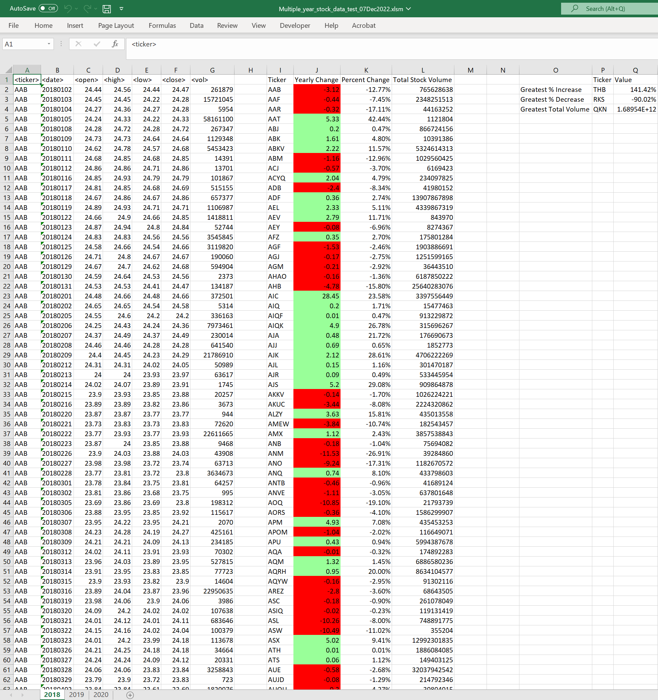
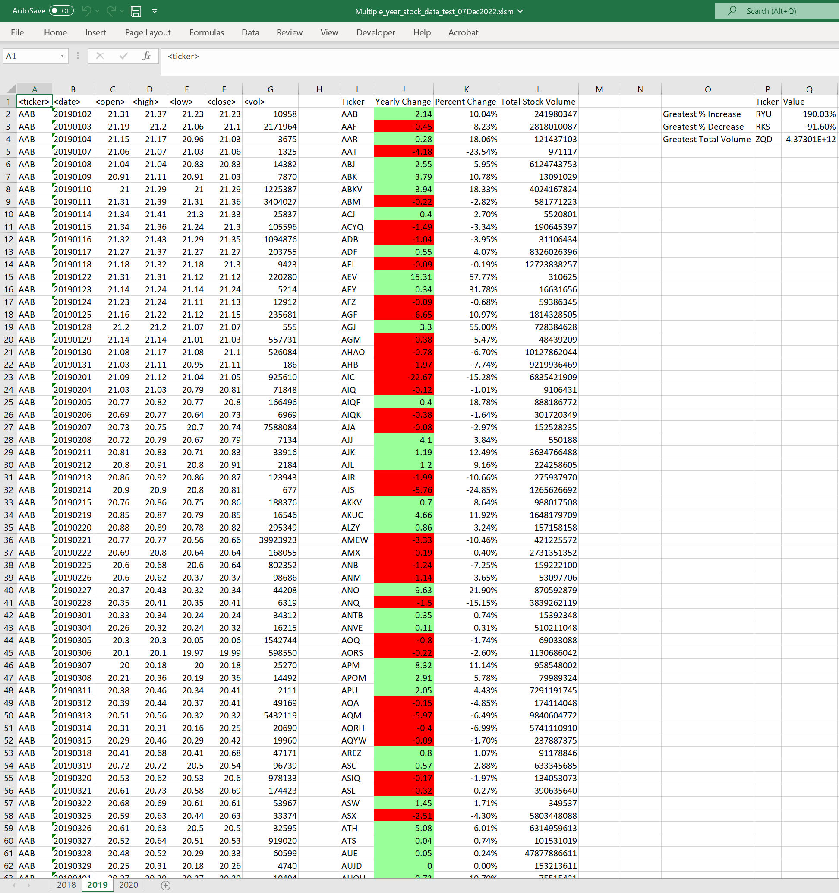
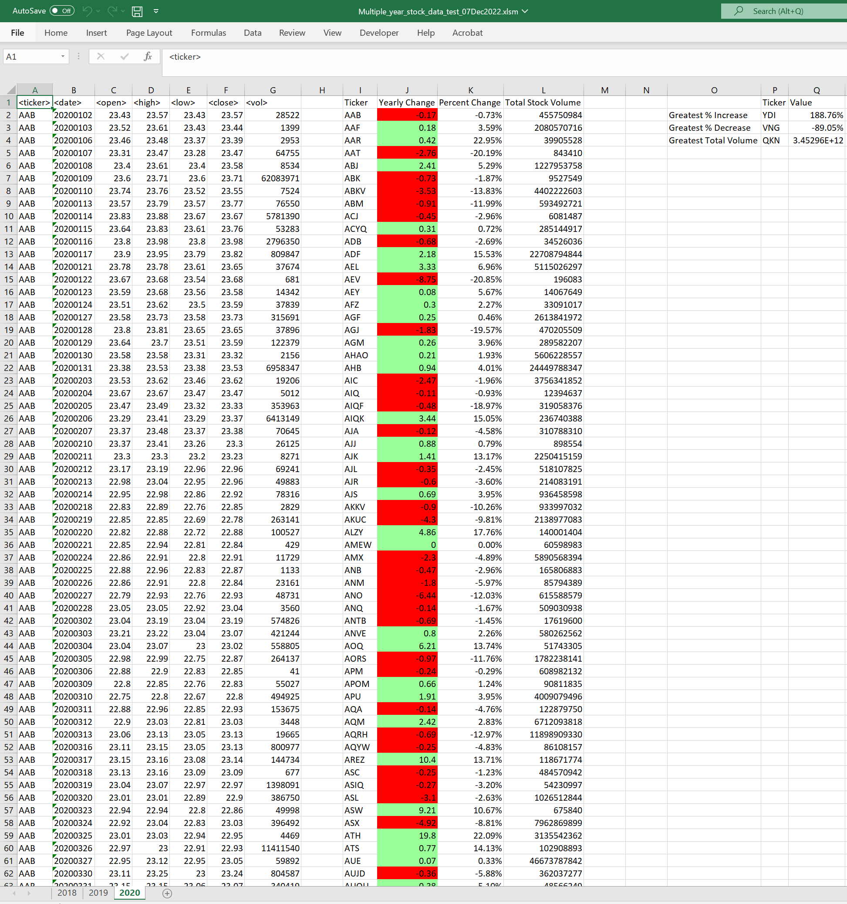

# VBA Homework: The VBA of Wall Street

## Background

The code  calculates the Number of worksheets and performs the required tasks in all the sheets. 

The work done per sheet is as follows:

A. Summary titles are labeled
B. The sheet is checked until an empty space is found (i.e no more ticker related information is available)
C. Open value per ticker is recorded
D. Total volume is cumulatively calculated per ticker
E. After reaching the last day of a given ticker, final volume and closing values are recorded.
F. Summary results per Ticker, Yearly Change, Percent Change and Total Stock Volume are recorded in the designated area
G. Once all the summary results are completed, the row positions for the Greatest Volume, Greatest Increase and decrease are identified.
H. The summaries for Greatest Volume, Greatest Increase and decrease are recorded in the designated areas
I. Once all the data is available in the spreadsheet, the formatting is adjusted to have the required color with the yearly change value,
   the percentages, and cell spacing.

## Instructions

Create a script that loops through all the stocks for one year and outputs the following information:

  * The ticker symbol. --> Done

  * Yearly change from opening price at the beginning of a given year to the closing price at the end of that year. --> Done

  * The percent change from opening price at the beginning of a given year to the closing price at the end of that year. --> Done

  * The total stock volume of the stock. --> Done

**Note:** Make sure to use conditional formatting that will highlight positive change in green and negative change in red. --> This was done after all the information was made available 

The results below:

## Bonus

Add functionality to your script to return the stock with the "Greatest % increase", "Greatest % decrease", and "Greatest total volume". 

Make the appropriate adjustments to your VBA script to allow it to run on every worksheet (that is, every year) just by running the VBA script once. --> Done

## Submission

To submit, please upload the following to GitHub:

  * A screen shot for each year of your results on the multi-year stock data. ---> 3 files uploaded "Result_2018_Sheet.PNG","Result_2019_Sheet.PNG" and "Result_2020_Sheet.PNG" 

  * VBA scripts as separate files. ---> One file which contains the main sub and related funcgtions was uploaded --> "Week_02_Challenge_Code_Luis_Cardenas.vb"

